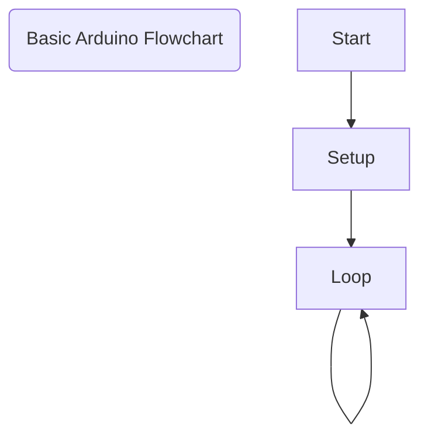
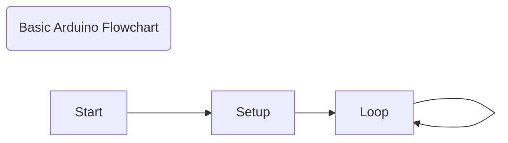

# Example_3_BlinkList

This diagram is being built using Mermaid.

https://mermaid.js.org/intro/getting-started.html

```mermaid
flowchart TD
    id1(Basic Arduino Flowchart) 
    Start --> Setup
    Setup --> Loop
    Loop --> Loop
```

```mermaid
flowchart LR
    id1(Basic Arduino Flowchart) 
    Start --> Setup
    Setup --> Loop
    Loop --> Loop
```

