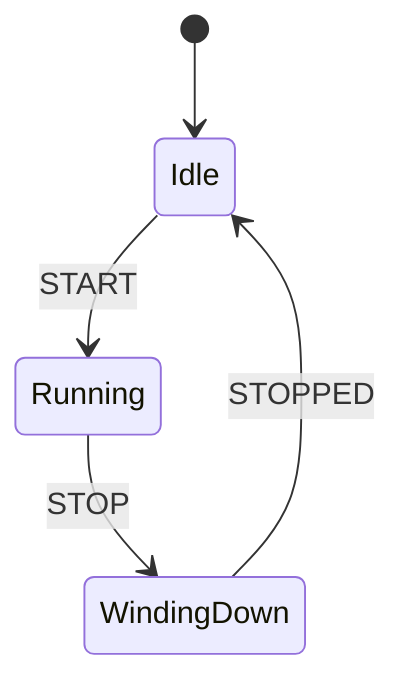

# Example_4_StateMachine

This is adapted from the Motor control example in the StateMachine documentation.
See the web page https://www.etlcpp.com/fsm.html

This diagram is being built using Mermaid.

https://mermaid.js.org/intro/getting-started.html

