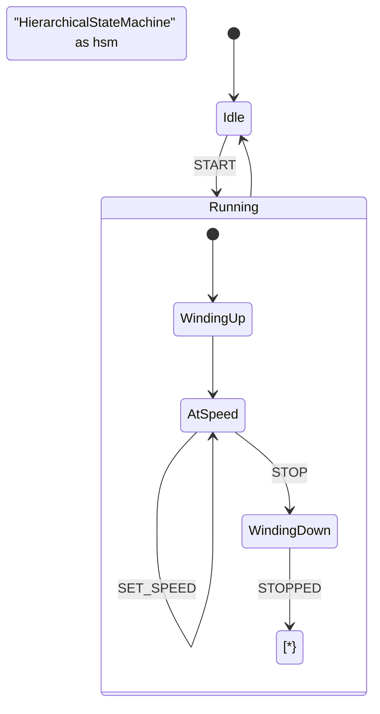

# Example_5_StateMachine

This is an example implementation of the HierarchicalStateMachine.

This diagram is being built using Mermaid.

https://mermaid.js.org/intro/getting-started.html

```mermaid
stateDiagram-v2
   state: "HierarchicalStateMachine" as hsm
   [*] --> Idle
   Idle --> Running : START
   state Running {
   [*] --> WindingUp
   WindingUp --> AtSpeed
   AtSpeed--> WindingDown : STOP
   AtSpeed --> AtSpeed : SET_SPEED
   WindingDown --> [*} : STOPPED
   }
   Running --> Idle
```

